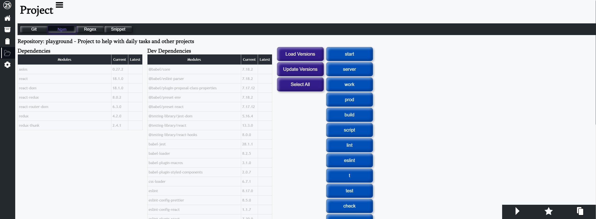

# Q

Used to help with building other projects, as well improving efficiency for arbitrary tasks

## Features

- Home: To do list and global timers will alerts that fire on any page.
- File: Storage for important files. Also perform string ops, regex, and json ops.
- Clipboard: Storage for passwords also links, commands, a textual info.
- Project: Git, Npm, Regex and Snippets.
  Checkout Stash/Branch or delete.
  Updating package.json and running package scripts.
  Run project level regex.  
  Stores saved snippets.
- Quick Access Footer: list of commands to execute, Links, as well as copy/paste values
- Settings: Sets what appears in Commands, Links, Directories, and Copy/Paste
