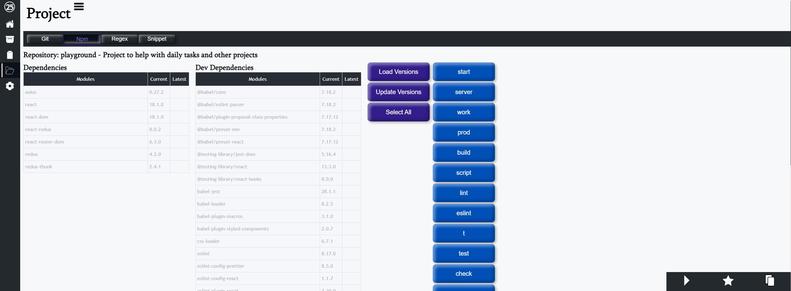

# Q

Used to help with building other projects, as well improving efficiency for arbitrary tasks

## Features

- Home (Clipboard) page to configure timer and copy/paste values
- File: Perform string ops, regex, and json ops.
- Quick Access Footer: copy/paste values and timer
- Experiment: page to test html, css, react

## Notes

- git history of this project is partly contained in the playground project as this was transferred from there.
- server for this application is stored in the project node-server